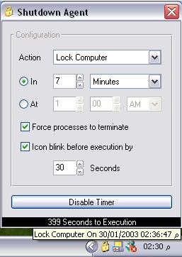

## Shutdown Agent

### Description

*This is a complete application, I hope you find it helpful. It's not heavily commented but the code is easy to read and understand and will hopefully teach you alot:

-Very useful Date & Time functions

-Mimicing a Spinner Control using a Text Box & a Vertical Scroll Bar

-Adding XP Style Support to VB Apps using a manifest file compiled within the executable as a resource

-API calls to perform the following:

1. Add a System Tray Icon and make it blink

2. Run the eMail client, or open the web browser to a certain website

3. Identify the operating system

4. Shutdown, Restart, and Log Off: All Versions of Windows

5. Suspend (Stand by), Hibernate: Win98 or later, win2000 or later

6. Lock Computer: win2000 or later
 
### More Info
 

             |
---                |---
**Submitted On**   |2003-01-29 23:31:38
**By**             |[Waleed A\. Aly](https://github.com/Planet-Source-Code/PSCIndex/blob/master/ByAuthor/waleed-a-aly.md)
**Level**          |Intermediate
**User Rating**    |4.9 (39 globes from 8 users)
**Compatibility**  |VB 5\.0, VB 6\.0
**Category**       |[Complete Applications](https://github.com/Planet-Source-Code/PSCIndex/blob/master/ByCategory/complete-applications__1-27.md)
**World**          |[Visual Basic](https://github.com/Planet-Source-Code/PSCIndex/blob/master/ByWorld/visual-basic.md)
**Archive File**   |[Shutdown\_A1536711302003\.zip](https://github.com/Planet-Source-Code/waleed-a-aly-shutdown-agent__1-42810/archive/master.zip)

